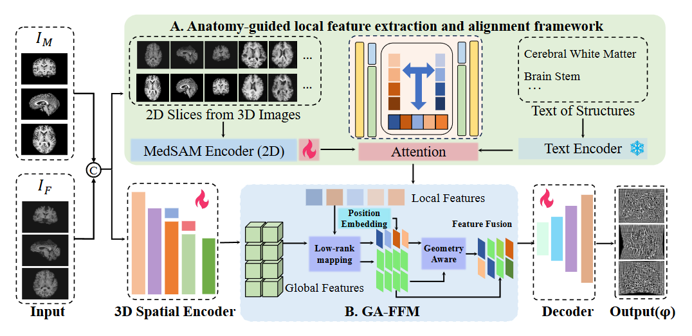
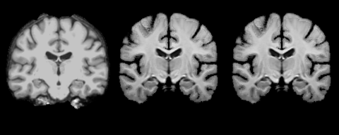
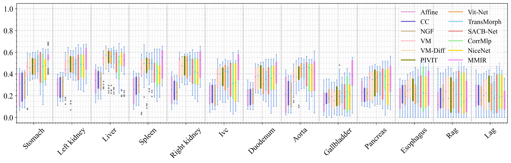
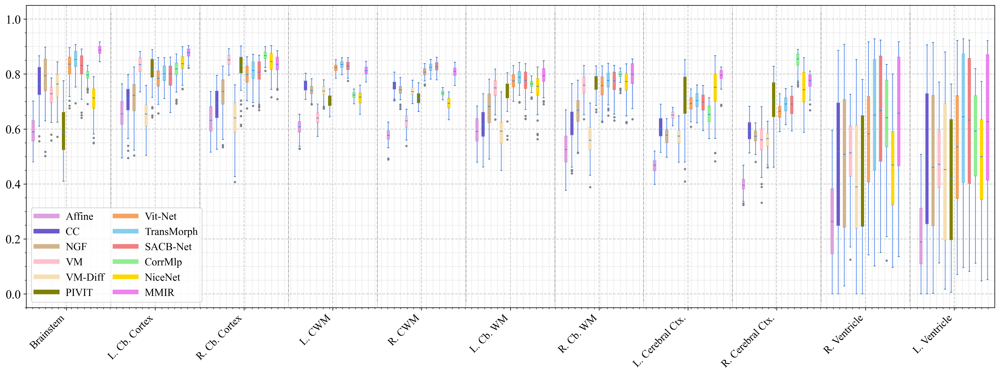

# MGGA

Official repository for our paper on medical image registration.

MGGA is a MedSAM-Guided Geometry-Aware framework designed for deformable medical image registration. The core idea is to combine semantically meaningful 2D representations with global 3D volumetric context, so the model can capture fine anatomical details without losing spatial coherence.

## Overview

Medical image registration needs both precise local alignment and stable global deformation modeling. MGGA addresses this challenge with three key ideas:

- MedSAM-guided 2D representations to provide strong local anatomical cues.
- A lightweight 3D encoder to model global spatial dependencies across the volume.
- A geometry-aware 2D-3D fusion strategy that aligns features across dimensions and scales.

In addition, MGGA uses explicit mask-level constraints together with implicit semantic guidance to encourage anatomically plausible and smooth deformations.

## Framework



## Demo



## Experimental Results

MGGA is evaluated on brain MRI and abdominal CT registration tasks. Across the benchmarks used in the paper, the method shows strong performance on overlap and boundary metrics such as DSC, ASSD, and HD95, while also preserving topological validity.

### FLARE 2022



### IXI



### OASIS-3


## Datasets

- [OASIS-3](https://sites.wustl.edu/oasisbrains/home/oasis-3/): a large-scale longitudinal brain MRI dataset for aging and Alzheimer's disease research.
- [IXI Dataset](https://brain-development.org/ixi-dataset/): a multi-site brain MRI dataset collected from healthy subjects.
- [MICCAI FLARE 2022](https://flare22.grand-challenge.org/): an abdominal CT benchmark for robust multi-organ analysis.

## References

```bibtex
@article{lamontagne2019oasis,
  title={OASIS-3: longitudinal neuroimaging, clinical, and cognitive dataset for normal aging and Alzheimer disease},
  author={LaMontagne, Pamela J and Benzinger, Tammie LS and Morris, John C and Keefe, Sarah and Hornbeck, Russ and Xiong, Chengjie and Grant, Elizabeth and Hassenstab, Jason and Moulder, Krista and Vlassenko, Andrei G and others},
  journal={medrxiv},
  pages={2019--12},
  year={2019},
  publisher={Cold Spring Harbor Laboratory Press}
}
@book{ma2023fast,
  title={Fast and Low-Resource Semi-supervised Abdominal Organ Segmentation: MICCAI 2022 Challenge, FLARE 2022, Held in Conjunction with MICCAI 2022, Singapore, September 22, 2022, Proceedings},
  author={Ma, Jun and Wang, Bo},
  volume={13816},
  year={2023},
  publisher={Springer Nature}
}
```

## Notes

This repository focuses on the research implementation and visual results of MGGA. The project will continue to be cleaned up and improved over time.
